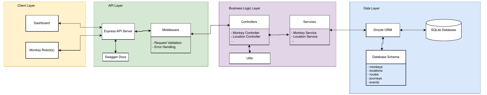

# 🐵 Monkey – Backend

An Express + TypeScript API for managing interactive monkey robots that assist hospital visitors in finding their way through the hospital.

## 🚀 Tech Stack

- **Express** (v5)
- **TypeScript**
- **SQLite** (local file DB)
- **Drizzle ORM**
- **Swagger (OpenAPI)** docs
- **Vitest** (unit/integration testing)

### Prerequisites

- Node.js (v20 recommended)
- pnpm

## 📁 Project Structure

```
backend/
│
├── .env                        # Environment variables
├── .gitignore                  # Git ignored files
├── tsconfig.json               # TypeScript configuration
├── drizzle.config.ts           # Drizzle configuration
├── package.json                # Project metadata & scripts
│
├── db/
│   ├── db.ts                   # Drizzle DB connection
│   ├── schema.ts               # Table definitions
│   ├── monkey.db               # Sqlite DB file
│   └── seed.ts                 # Seed sample data
│
├── src/
│   ├── swagger/                # Swagger config & docs
│   ├── routes/
│   │   ├── monkeyRoutes.ts     # Monkey endpoints
│   │   └── dashboardRoutes.ts  # Dashboard endpoints
│   ├── services/
│   │   ├── monkeyService.ts    # DB interaction for monkey logic
│   │   ├── locationService.ts  # DB interaction for location logic
│   │   └── ...
│   ├── controllers/
│   │   ├── monkeyController.ts # Monkey request handlers
│   │   └── dashboardController.ts  # Dashboard request handlers
│   ├── utils/
│   │   └── ...                 # All utility functions
│   ├── types.ts                # Typescript types only used in the backend
│   ├── config.ts               # Application configuration consts
│   ├── logger.ts               # Custom logging functions
│   ├── errors.ts               # Custom application errors
│   └── index.ts                # Application entry point
│
├── tests/                      # All test files (unit/integration)
│   └── monkeyService.integration.test.ts
│
└── README.md                   # Project documentation
```

## ⚙️ How to Run

🚨 WARNING:
if you haven't run `pnpm valdiation:build` from the root folder yet, pls do so before or you will get errors when trying to run the server. (take a look at the validation package README.md)

### 1. Install

(You don't need this if you already did `pnpm install` from the root folder)

```bash
pnpm install
```

### 2. Environmental Variables `.env`

Create an `.env` file in the backend folder and fill it with the following variables (values are only examples):

(Actually I don't think it's really used... it's not used in the drizzle.config at least, so be careful)

```env
DATABASE_URL=./db/monkey.db         # Path to SQLite DB file
```

### 3. Start the server and DB

On first run: initialize the DB with tables by running

```bash
pnpm init-db
```

then start the server

```bash
pnpm dev
```

> Runs with `tsx` and watches changes live. No need to manually reload or restart

### 4. Build

```bash
pnpm build
pnpm start
```

> Compiles TypeScript to `dist/` and runs the compiled app.

## 📖 Docs

you can find some hopefully clarifying diagrams and explanations in the [Docs Folder](./docs/).

### Backend Structure Diagram

The backend is divided into three main layers. First, there is the **API Layer**, which manages API calls and their
validation, as well as any other middleware tasks before passing requests to the next layer. It serves as the
interface for clients, such as robots or the dashboard, to communicate with the backend. Next is the **Business
Logic Layer**, which handles all core logic of the system. Controllers in this layer act as intermediaries
between the API and the services responsible for data handling. Controllers do not have direct access to the
database. Instead, services act as the gateway to the database, with their sole purpose being to retrieve and
format data for the controllers. Finally, there is the **Data Layer**, which represents the database and everything
related to data persistence.



## 🧠 API Overview

### Base URL

```
http://localhost:7000
```

### Swagger Docs

```
http://localhost:7000/api-docs
```

You can test endpoints and their responses through Swagger UI or manually using curl.

Example using curl to get all monkeys:

```bash
curl -X GET "http://localhost:7000/v1/monkeys" -H "Content-Type: application/json"
```

## 🗃️ SQLite Database

Database file is created automatically at first run.

📄 File: `db/monkey.db`

If you want to initialize the DB with empty tables on first run, run the following command:

```bash
pnpm init-db
```

If you want to run tests, you will have to create a `monkey-test.db` file on the same level as the normal DB file.

### ✅ Tables created

- `monkeys` – interactive monkey robots
- `locations` – places in the hospital
- `routes` – directions between locations
- `journeys` – tracks a visitor's journey, QR tokens, and status
- `events` – logs of events (button presses etc.)

All tables are initialized on startup, with foreign key relationships where needed.

If you want to **populate with demo data**, make sure the seed is called in `index.ts`:

```ts
// index.ts

const initDB = async () => {
  pingDB();
  await seedData(); // 👈 enable or comment out this to auto-seed or not
};
```

## 📦 Scripts

| Script         | Description                                   |
| -------------- | --------------------------------------------- |
| `pnpm dev`     | Run dev server with auto-reload (tsx)         |
| `pnpm build`   | Compile to `dist/`                            |
| `pnpm start`   | Run compiled app from `dist/index.js`         |
| `pnpm init-db` | Push latest Drizzle schema directly to the DB |
| `pnpm test`    | Run all Vitest tests                          |

## 🧪 Tests

You can run some basic tests on the backend with vitest.

🚨 WARNING:  
the tests are done on a real db file. You have to add a `monkey-test.db`file if you don't want to ruin the production db. If you do so, you will have to change the drizzle db path in the `drizzle.config.ts` file so it actually takes your testing db. Or just add an .env variable for the testing environment that automatically chooses the right db file. I didn't have the time for it.

```bash
pnpm test
```

> Runs all Vitest tests in the `tests/` directory.

## 🔧 VSCode Extensions

I recommend getting the following VScode extensions to work with the repository:

- [SQLite Viewer](https://marketplace.visualstudio.com/items?itemName=qwtel.sqlite-viewer) (You will be able to see the data stored in the database)

otherwise you could also take a look at the [SQLite Browser](https://sqlitebrowser.org/) where you can also run SQL and do more stuff without having to pay. Or just use the terminal, as you like of course ;)
