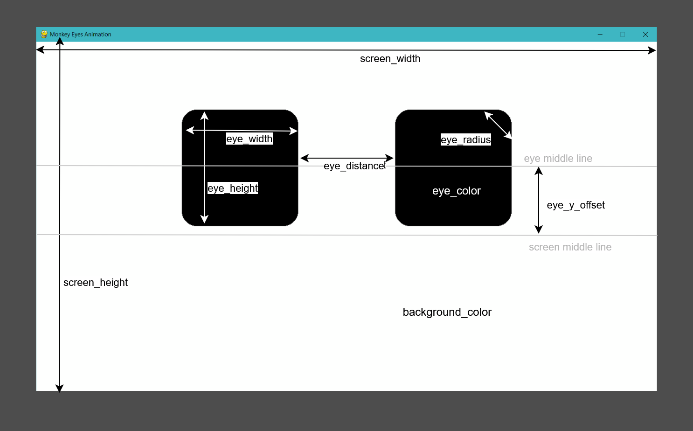

# Monkey Eyes Animation Library Documentation

The Monkey Eyes Animation Library is a Python-based system for creating animated eye expressions using Pygame.

## Table of Contents

1. [Installation & Setup](#installation--setup)
2. [Core Classes](#core-classes)
3. [Configuration & Customization](#configuration--customization)
4. [Animation States](#animation-states)
5. [Usage Examples](#usage-examples)
6. [API Reference](#api-reference)

## Installation & Setup

### Prerequisites

```bash
pip install pygame
```

### Basic Setup

1. Save the library code as `monkey_eyes_lib.py`
2. Import and use in your project:

```python
from monkey_eyes_lib import EyesController
import time

# Create controller instance
controller = EyesController()

# Start the eyes animation
controller.start_eyes()

# Your application code here...

# Stop when done
controller.stop_eyes()
```

## Core Classes

### Eye Class

Represents a single eye with position, size, and rendering capabilities.

**Key Properties:**

- `rect`: Current position and size (pygame.Rect)
- `original_rect`: Original position and size for reset operations
- `radius`: Border radius for rounded corners
- `color`: RGB color tuple

**Key Methods:**

- `draw()`: Renders normal rectangular eye
- `draw_circular()`: Renders circular/laughing eye
- `draw_star()`: Renders star-shaped eye
- `grow()`, `move()`: Transform eye size and position
- `reset()`: Return to original state

### EyePair Class

Manages both left and right eyes as a coordinated unit.

### AnimationManager Class

Controls all animation states and transitions.

**Key Features:**

- State machine for different expressions
- Timing management for animations
- Natural behavior triggers (blinking, looking)
- Smooth transitions between states
- Blinking system with single/double blinks

### EyesController Class

Your main interface for controlling the eyes from external applications.

**Key Methods:**

- `start_eyes()`: Initialize and start eye process
- `stop_eyes()`: Cleanly shutdown eye process
- `trigger_*()`: Various animation triggers

## Configuration & Customization

### Eye Appearance Configuration

The `MonkeyEyeApp` class contains several configuration variables you can modify:

#### Screen & Layout Settings

```python
# Screen dimensions
screen_width = 1280          # Window width in pixels
screen_height = 720          # Window height in pixels
background_color = (255, 255, 255)  # RGB background color

# Eye positioning and size
eye_width = 240              # Width of each eye in pixels
eye_height = 240             # Height of each eye in pixels
eye_distance = 100           # Distance between the two eyes
eye_radius = 30              # Corner radius for rounded rectangles
eye_color = (0, 0, 0)        # RGB eye color
star_color = eye_color       # RGB eye color for the star animation (default eye_color or if not defined yellow)
eye_y_offset = 100           # distance between the middle line and the middle of the eyes (0 = eyes are vertically centered)
```

<div style="display: flex; justify-content: center;">

</div>

#### Animation Timing Configuration

Located in the `AnimationManager.__init__()` method:

```python
# Blinking behavior
blink_speed = 15             # How fast eyes close/open (pixels per frame)
blink_interval = random.uniform(2000, 4000)  # Time between blinks (ms)
blink_pause_duration = 150   # Pause between double blinks (ms)

# Laughing animation
laugh_speed = 2              # Vertical movement speed
max_laugh_offset = 20        # Maximum vertical displacement
laugh_cycles = 4             # Number of up-down cycles

# Looking/Movement behavior
move_speed = 10              # Horizontal movement speed
max_move_distance = 200      # How far eyes move when looking
squinting_degree = 5         # Amount of height reduction when squinting
look_interval = random.uniform(10000, 20000)  # Time between random looks

# Star animation
star_speed = 0.05            # Growth/shrink rate for stars
star_color = (255, 255, 0)   # RGB color for stars (yellow)

# Default durations (milliseconds)
smile_duration = 2000        # Default smile length
star_duration = 3000         # Default star eyes length
concentrate_duration = 2000  # Default concentration length
```

## Animation States

### Available States

| State           | Description                                 | Trigger Method            | Duration     | Special Features                |
| --------------- | ------------------------------------------- | ------------------------- | ------------ | ------------------------------- |
| `IDLE`          | Default state with natural blinking/looking | Automatic                 | Continuous   | Random single/double blinks     |
| `BLINKING`      | Eye closing and opening animation           | `trigger_blinking()`      | ~200-500ms   | Single or double blink variants |
| `LAUGHING`      | Up-down bouncing circular eyes              | `trigger_laugh()`         | ~2-3 seconds | 4 bounce cycles                 |
| `SMILING`       | Slight upward curved circular eyes          | `trigger_smile(duration)` | Configurable | Static circular eyes            |
| `STAR`          | Star-shaped eyes that grow and shrink       | `trigger_star(duration)`  | Configurable | Animated scaling                |
| `MOVING`        | Horizontal eye movement with squinting      | `trigger_look()`          | ~3-4 seconds | Currently disabled in IDLE      |
| `CONCENTRATING` | Narrowed/squinted eyes                      | `trigger_concentrate()`   | Configurable | Supports indefinite mode        |

### Blinking System Details

**Blink Types:**

- **Single Blink**: Standard one-time eye closure and opening
- **Double Blink**: Two rapid blinks with a short pause between them

**Blink Mechanics:**

- Random selection between single and double blinks during idle state
- Configurable pause duration between double blinks (default: 150ms)
- Natural timing intervals (3-8 seconds between blink sequences)

**Note**: Direct transitions between non-IDLE states automatically reset eye position/size before starting the new animation.

## Usage Examples

### Basic Usage

```python
from monkey_eyes_lib import EyesController
import time

controller = EyesController()

try:
    # Start the eyes
    controller.start_eyes()
    print("Eyes started - they'll blink naturally (single and double blinks)")

    # Let them idle for a few seconds to observe natural blinking
    time.sleep(10)

    # Trigger a smile
    controller.trigger_smile()
    time.sleep(2)

    # Trigger laughter
    controller.trigger_laugh()
    time.sleep(3)

finally:
    controller.stop_eyes()
```

### Advanced Animation Sequence

```python
from monkey_eyes_lib import EyesController
import time

def demo_sequence():
    controller = EyesController()

    try:
        controller.start_eyes()

        # Observe natural blinking behavior
        print("👀 Watching natural blinking behavior (single and double blinks)")
        time.sleep(8)

        # Happy sequence
        print("😊 Smiling for 3 seconds")
        controller.trigger_smile(3000)
        time.sleep(4)

        print("😂 Laughing")
        controller.trigger_laugh()
        time.sleep(3)

        # Amazed sequence
        print("🤩 Star eyes for 4 seconds")
        controller.trigger_star(4000)
        time.sleep(5)

        # Concentration sequence
        print("🤔 Concentrating indefinitely")
        controller.trigger_concentrate(indefinite=True)
        time.sleep(3)

        print("💡 Stopping concentration")
        controller.stop_concentrate()
        time.sleep(2)

        # Custom duration smile
        print("😊 Quick smile")
        controller.trigger_smile(1000)  # 1 second smile
        time.sleep(2)

        print("Returning to idle state")
        time.sleep(8)

    except KeyboardInterrupt:
        print("Demo interrupted")
    finally:
        controller.stop_eyes()

if __name__ == "__main__":
    demo_sequence()
```

## API Reference

### EyesController Methods

#### `start_eyes()`

Initializes and starts the eye animation process.

- **Returns**: None
- **Side effects**: Creates new process and command queue
- **Notes**: Safe to call multiple times (checks if already running)

#### `stop_eyes()`

Cleanly shuts down the eye animation process.

- **Returns**: None
- **Timeout**: 3 seconds for graceful shutdown, then force terminate
- **Notes**: Always call this when your application exits

#### `trigger_smile(duration_ms=None)`

Triggers a smiling expression.

- **Parameters**:
  - `duration_ms` (int, optional): Duration in milliseconds (default: 2000)
- **Example**: `controller.trigger_smile(1500)`

#### `trigger_laugh()`

Triggers a laughing animation (up-down bouncing).

- **Parameters**: None
- **Duration**: Fixed ~2-3 seconds (4 bounce cycles)
- **Example**: `controller.trigger_laugh()`

#### `trigger_star(duration_ms=None)`

Triggers star-shaped eyes animation.

- **Parameters**:
  - `duration_ms` (int, optional): Duration in milliseconds (default: 3000)
- **Example**: `controller.trigger_star(5000)`

#### `trigger_concentrate(duration_ms=None, indefinite=False)`

Triggers concentration/squinting animation.

- **Parameters**:
  - `duration_ms` (int, optional): Duration in milliseconds (default: 2000)
  - `indefinite` (bool): If True, continues until `stop_concentrate()` called
- **Examples**:
  - `controller.trigger_concentrate(4000)`
  - `controller.trigger_concentrate(indefinite=True)`

#### `stop_concentrate()`

Stops indefinite concentration animation.

- **Parameters**: None
- **Notes**: Only affects indefinite concentration; timed concentration ends automatically
- **Example**: `controller.stop_concentrate()`
